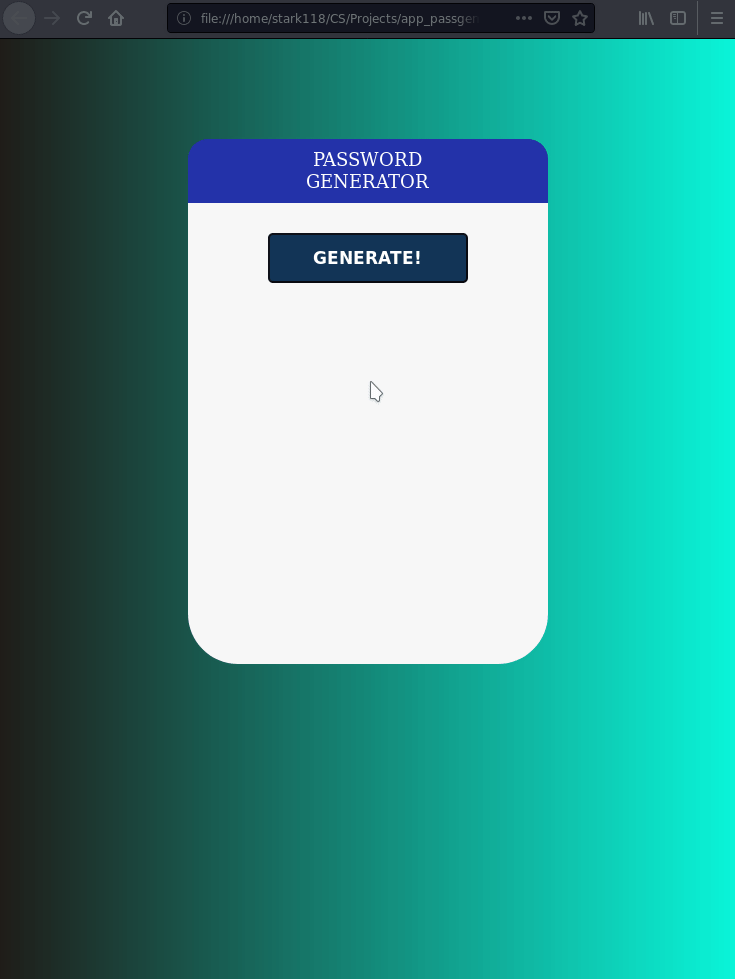

# password_gen

Reads a given JSON file of over 400,000 words and to form a secure password following a format consisting of two uppercase letters, a number, and a digit.

What it does:
- XMLHttpRequest objects to retrieve data from server, or in this program's case,a local JSON file
- Simplest form of asynchronous request
- Parses JSON file, creating an iterable object
- Generate random words, symbols, numbers, from the JSON file, list, random method respectively

The words list was obtained from [github.com/dwyl](https://github.com/dwyl/english-words); the words are from infochimps.com and as such copyright belongs to them.
